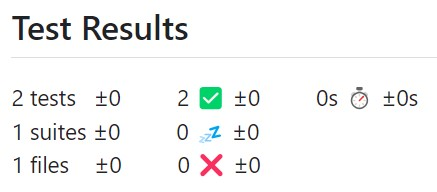

# FindDoctor
> FindDoctor 為蒐尋醫生評價網頁，希望能減少病患求醫焦慮、讓更多人看見好醫生。
- Set up a **CI/CD** pipeline with **GitHub Actions**, which runs **unit test** with **PyTest** and deploys with **Docker**.
- Apply **Elasticsearch** and **RDS(MySQL)** as database and update data in database every week with **APScheduler**.
- Implement caching with **Redis** and run **threads** to fetch different data simultaneously.
- Use **NGINX** as reverse proxy and secure connections with **SSL** Certificate.
- Use **Selenium**、**BeautifulSoup**、**Pdfplumber** and connect **Google Cloud API** to get data.

### Link

https://finddoctor.abinitio.fun/

### How to use

選擇臺北榮總科別/醫生選單或直接輸入醫生姓名後，可取得榮總感謝函、Blog、Ptt、Dcard、Google Review、良醫網及司法院資訊。

### Architecture

![][architecture]

[architecture]: ./readme/Architecture.jpg

### Database

![][database]

[database]: ./readme/database.jpg

### CI/CD

![][CICD]

[CICD]: ./readme/CICD.jpg

### PyTest Report

### Demo

![][demo1]

[demo1]: ./readme/demo1.png

![][demo2]

[demo2]: ./readme/demo2.png
